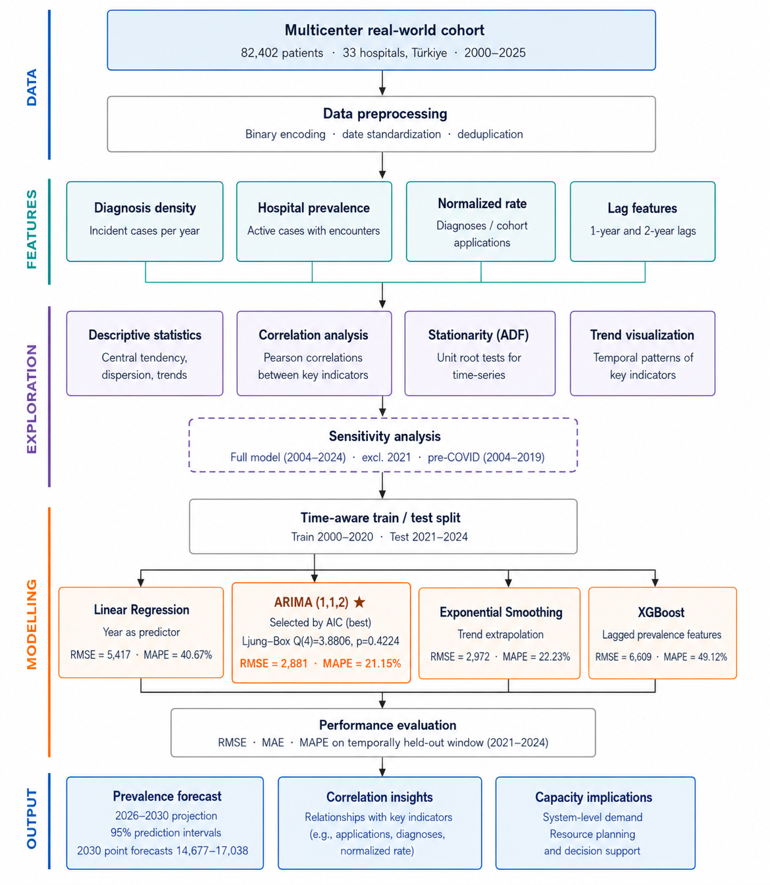
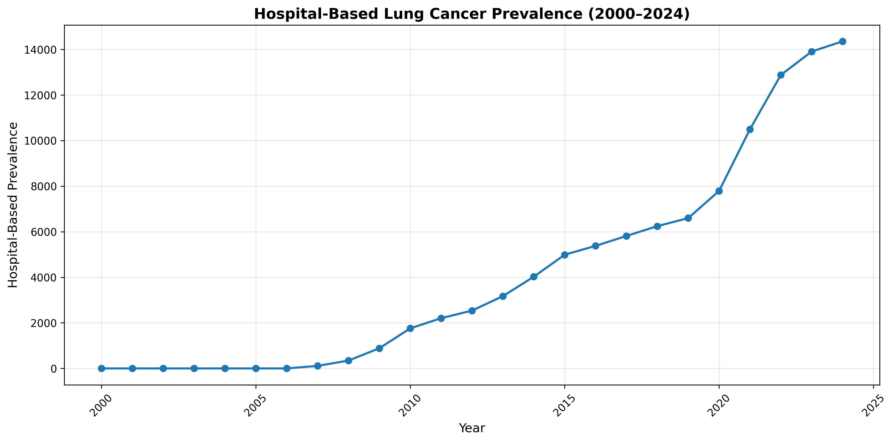
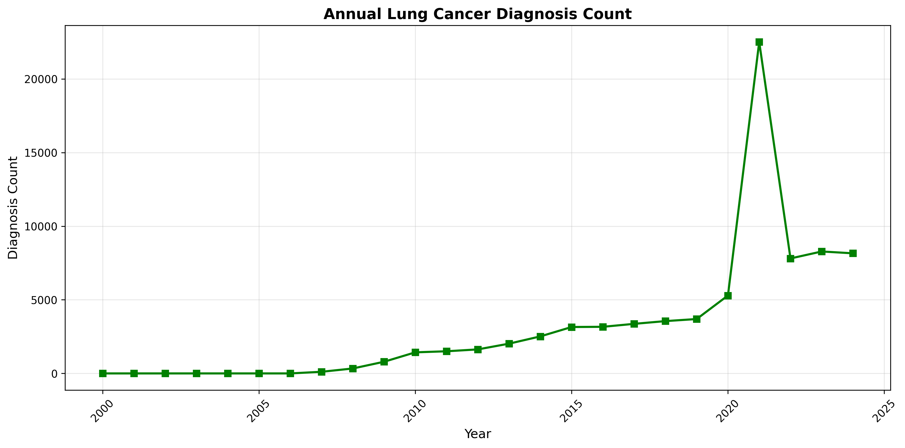
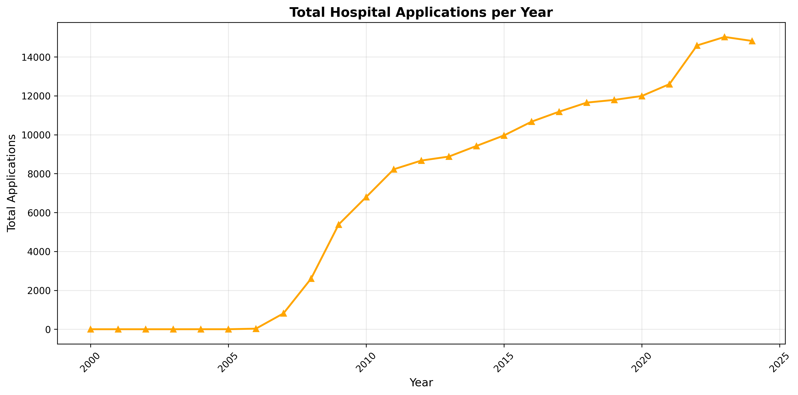
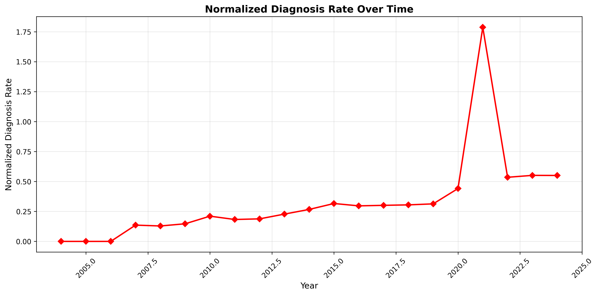
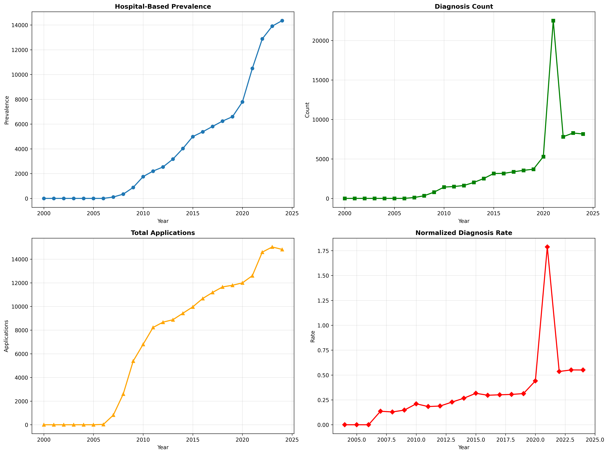
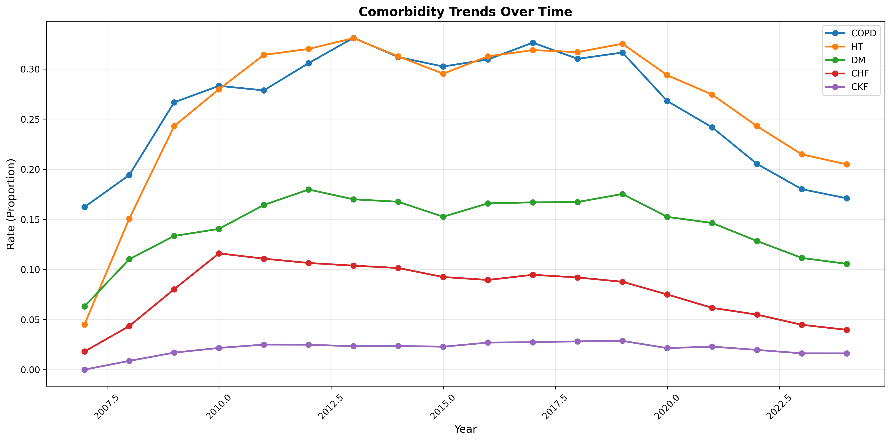
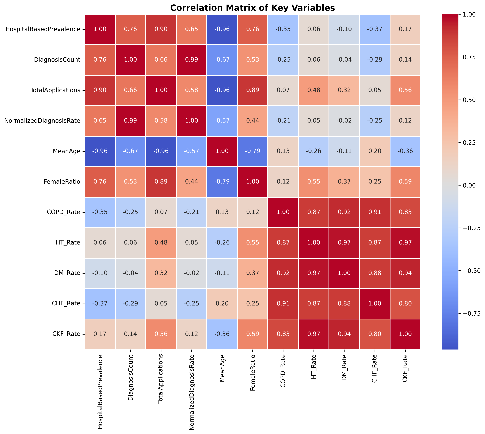
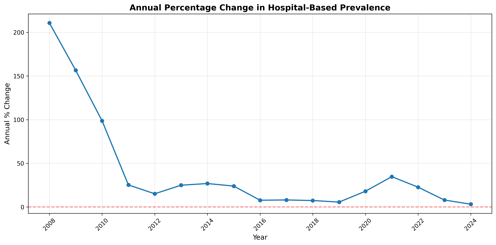
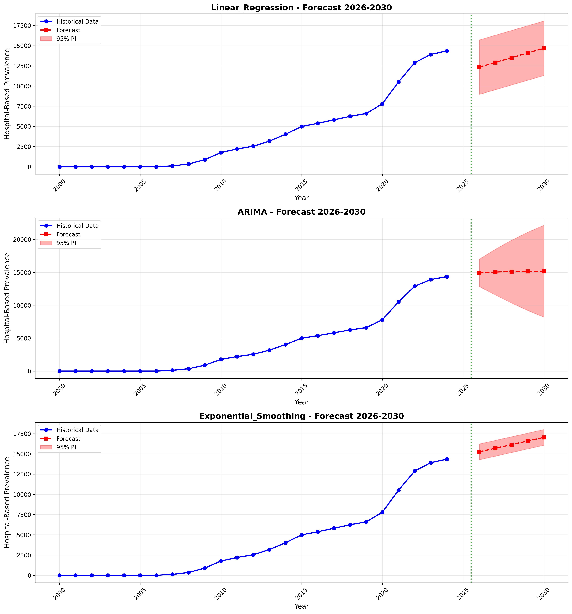

# IstinyeLungCancer

## Forecasting Lung Cancer Burden Using Multicenter Real-World Data

This repository contains the analysis code, figures, and workflow materials associated with the study:

**Forecasting Lung Cancer Burden Using Multicenter Real-World Data**

The study analyzes a retrospective multicenter real-world cohort of **82,402 patients with lung cancer treated across 33 hospitals in Türkiye**. Patient diagnosis records cover **2000–2025**, while year-specific hospital application data used for the annual hospital-based prevalence series cover **2000–2024**.

The main objectives are to:

- characterize long-term trends in hospital-based lung cancer burden,
- examine diagnosis activity relative to healthcare utilization,
- evaluate annual prevalence and related temporal indicators,
- assess stationarity and correlations among key variables,
- compare statistical forecasting models using a temporally held-out test period,
- evaluate XGBoost as an additional machine-learning benchmark, and
- generate hospital-based prevalence projections for **2026–2030**.

---

## Repository Structure

### Analysis scripts

| File | Description |
|---|---|
| `stage1.py` | Data preprocessing and construction of the annual year-level dataset. Creates annual diagnosis counts, hospital-based prevalence, total hospital applications, normalized diagnosis rate, demographic/comorbidity summaries, and lag variables. |
| `stage2.py` | Descriptive statistics, Pearson correlation analysis, Augmented Dickey-Fuller stationarity testing, and temporal trend visualization. |
| `stage3.py` | Statistical trend analysis, sensitivity analysis, temporal train/test evaluation, ARIMA model selection and diagnostics, comparison of Linear Regression, ARIMA, and Exponential Smoothing, and prevalence forecasting for 2026–2030. |
| `stage4.py` | XGBoost machine-learning benchmark using lagged prevalence features, restricted time-aware hyperparameter selection, temporally held-out evaluation, and diagnostic analysis of extrapolation behavior. |

---

## Analysis Workflow

The analysis follows four main computational stages:

1. **Dataset construction**
   - binary encoding and date standardization,
   - annual diagnosis count calculation,
   - hospital-based prevalence construction,
   - annual hospital application aggregation,
   - normalized diagnosis-rate calculation,
   - demographic and comorbidity aggregation,
   - one-year and two-year lag generation.

2. **Exploratory and statistical analysis**
   - descriptive statistics,
   - Pearson correlation analysis,
   - Augmented Dickey-Fuller stationarity testing,
   - visualization of longitudinal trends.

3. **Statistical forecasting**
   - temporal training period: **2000–2020**,
   - held-out test period: **2021–2024**,
   - Linear Regression,
   - ARIMA,
   - Exponential Smoothing,
   - forecast horizon: **2026–2030**.

4. **Machine-learning benchmark**
   - XGBoost using one-year and two-year lagged hospital-based prevalence,
   - effective XGBoost training period: **2002–2020**,
   - held-out test period: **2021–2024**,
   - restricted time-aware hyperparameter selection.

---

## Main Forecasting Results

The forecasting approaches were evaluated on the temporally held-out 2021–2024 period.

| Model | RMSE | MAE | MAPE |
|---|---:|---:|---:|
| ARIMA(1,1,2) | 2880.88 | 2781.86 | 21.15% |
| Exponential Smoothing | 2972.26 | 2901.68 | 22.23% |
| Linear Regression | 5416.88 | 5310.30 | 40.67% |
| XGBoost | 6609.09 | 6438.51 | 49.12% |

Among the statistical forecasting models, **ARIMA(1,1,2)** achieved the lowest held-out prediction error.

For ARIMA(1,1,2):

- AIC: **287.41**
- BIC: **291.39**
- Ljung-Box Q(4): **3.8806**
- Ljung-Box p-value: **0.4224**

XGBoost was retained as a comparative machine-learning benchmark but was not used for the final long-term projections because of its substantially poorer held-out performance and limited extrapolation capability in this short annual time series.

---

## Forecast Horizon

The final statistical models were refitted using the available observed annual prevalence series and used to generate forecasts for **2026–2030**.

For 2030, the point forecasts were approximately:

- Linear Regression: **14,677**
- ARIMA(1,1,2): **15,178**
- Exponential Smoothing: **17,038**

Forecast uncertainty is reported using 95% prediction intervals.

---

## Figures

### Study workflow



### Annual prevalence trend



### Annual diagnosis count



### Total hospital applications



### Normalized diagnosis rate



### Combined temporal trends



### Comorbidity trends



### Correlation matrix



### Annual percentage change



### Forecast comparison



---

## Key Variable Definitions

### Hospital-Based Prevalence

A patient is counted as a prevalent case in a calendar year if:

1. the first recorded lung cancer diagnosis occurred in or before that year, and
2. the patient had at least one recorded hospital encounter during that year.

This measure represents active hospital-based disease burden rather than population prevalence.

### Annual Diagnosis Density

Annual diagnosis density is defined as the number of patients with a first recorded lung cancer diagnosis in a given calendar year. Each patient is counted only once.

### Normalized Diagnosis Rate

The normalized diagnosis rate is calculated as:

`Annual diagnosis count / Total hospital applications within the lung cancer cohort`

The denominator represents healthcare utilization within the study cohort and should not be interpreted as total hospital activity across all patients.

---

## Important Time Periods

| Analysis component | Period |
|---|---|
| Patient diagnosis records | 2000–2025 |
| Hospital application records | 2000–2024 |
| Hospital-based prevalence series | 2000–2024 |
| Normalized diagnosis-rate analysis | 2004–2024 |
| Statistical model training | 2000–2020 |
| XGBoost training | 2002–2020 |
| Held-out testing | 2021–2024 |
| Final forecast horizon | 2026–2030 |

---

## Requirements

The scripts use standard Python scientific-computing and forecasting libraries, including:

```text
pandas
numpy
matplotlib
scipy
scikit-learn
statsmodels
xgboost
openpyxl
```

Install the required packages with:

```bash
pip install pandas numpy matplotlib scipy scikit-learn statsmodels xgboost openpyxl
```

---

## Running the Analysis

Run the scripts sequentially:

```bash
python stage1.py
python stage2.py
python stage3.py
python stage4.py
```

`stage1.py` prepares the year-level dataset used by the subsequent analysis stages.

> **Note:** The scripts may contain local file paths used during manuscript development. Update input and output paths as needed before running the analysis on another system.

---

## Data Availability

The repository contains analysis code and generated figures. The clinical dataset is not stored directly in this GitHub repository.

The data produced and examined in the present study are available through the Istinye University Dataset Sharing Platform. 
De-identified clinical datasets may be accessed via the following link: https://dataset.istinye.edu.tr/dataset?did=16, (accessed on 01 April 2026). 
All records were anonymized in full compliance with applicable ethical standards. 
Data access is granted exclusively for research use within a controlled-access framework, in accordance with the platform’s established data-sharing and licensing policies.
---.
## Reproducibility

The repository is intended to improve transparency and reproducibility by providing:

- preprocessing logic,
- annual variable construction,
- statistical analysis code,
- forecasting procedures,
- model evaluation,
- sensitivity analysis,
- XGBoost benchmark analysis, and
- figures used in the study.

---

## Citation

If you use this repository, please cite the associated article once the final publication details become available:

> Aydin O., Korkmaz L., Selim A., Kuzlu M., Catak F. O., Kusetogullari H., Cali U.  
> **Forecasting Lung Cancer Burden Using Multicenter Real-World Data.**


---

## Repository

https://github.com/phdomeraydin/IstinyeLungCancer

---

## License

Please add the appropriate license for the repository before public reuse or redistribution of the code.
